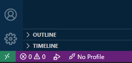
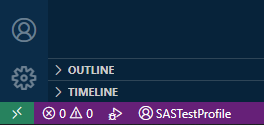

# SAS Clinical Acceleration Extension for Visual Studio Code

Welcome to the SAS Clinical Acceleration Extension for Visual Studio Code! This extension provides support for the SAS Clinical Acceleration repository including the following features:

- [SAS Clinical Acceleration Extension for Visual Studio Code](#sas-ca-extension-for-visual-studio-code)
  - [Installation](#installation)
  - [Configuring the SAS Clinical Acceleration Extension](#configuring-the-sas-extension)
    - [Setting Up Profiles](#setting-up-profiles)
    - [Accessing SAS Clinical Acceleration Content](#accessing-sas-clinical-acceleration-content)
  - [Features](#features)
    - [Repository View](#repository-view)
    - [Properties View](#properites-view)
    - [Version History View](#version-history-view)
  - [Support](#support)
    - [SAS Communities](#sas-communities)
    - [FAQs](#faqs)
    - [GitHub Issues](#github-issues)
  - [Contributing to the SAS Clinical Acceleration Extension](#contributing-to-the-sas-clinical-acceleration-repository-extension)
  - [License](#license)

## Overview

This extension enables you to interact with SAS Clinical Acceleration repository content. You can view, compare, and open files, visualize details of content items, track the history of versioned content, and upload and download content.

### Installation

To install the SAS Clinical Acceleration extension, open the Extensions view by clicking the Extensions icon in the [Activity Bar](https://code.visualstudio.com/api/ux-guidelines/activity-bar) on the left side of the Visual Studio Code window. Search for the 'SAS Clinical Acceleration' extension, and click the Install button. After the installation is complete, the 'Install' button becomes the 'Manage' button.

## Getting Started

### Configuring the SAS Clinical Acceleration Extension

Before accessing the SAS Clinical Acceleration repository, you must configure the extension to access a SAS Viya server with the SAS Clinical Acceleration services installed, configured and running. You must have a valid licence and account for authentication.

1. When first configuring, "No Profile" can be located on the [Status Bar](https://code.visualstudio.com/api/ux-guidelines/status-bar) located at the bottom left of your Visual Studio Code window.

   

2. Either select the "No Profile" status bar item or open the command palette (`F1`, or `Ctrl+Shift+P` on Windows or Linux, or `Shift+CMD+P` on OSX) and locate `SAS Clinical Acceleration: Add New Connection Profile`
3. See the section below to add a profile.
4. After a profile is created, the staus bar item changes from "No Profile" to the name of the new profile.

   

#### Setting Up Profiles

Profiles make it simpler to switch between multiple SAS deployments. For SAS Viya connections, multiple SAS Viya profiles can be used to switch between installations. There is no limit to the amount of profiles that can be stored.

Profiles will be stored into the VSCode settings.json file, and can be modified by hand, if necessary.

The following commands are supported for profiles:

| Command                                   | Title                                                        |
| ----------------------------------------- | ------------------------------------------------------------ |
| `SAS Clinical Acceleration.addProfile`    | SAS Clinical Acceleration: Add New Connection Profile        |
| `SAS Clinical Acceleration.switchProfile` | SAS Clinical Acceleration: Switch Current Connection profile |
| `SAS Clinical Acceleration.updateProfile` | SAS Clinical Acceleration: Update Connection profile         |
| `SAS Clinical Acceleration.deleteProfile` | SAS Clinical Acceleration: Delete Connection profile         |

Details about creating and managing profiles is available on the [Connect and Run page](/connect.md).

**Notes**:

- The SAS Clinical Acceleration extension requires a profile with a connection to a SAS Viya instance that has the SAS Clinical Acceleration application services installed and permissions granted for their use.

#### Accessing SAS Clinical Acceleration Content

After configuring the SAS Clinical Acceleration extension for a SAS Viya environment, you can access the SAS Clinical Acceleration repository content.

To access SAS Clinical Acceleration repository content:

1. Click the SAS Clinical Acceleration icon in VSCode's activity bar.
2. Click Sign In.
3. You can browse and view the repository content that is displayed, and peform actions based on the content type.

### Features

The SAS Clinical Acceleration extension provides access to content that is stored within the managed content repository services of the SAS Clinical Acceleration services.

#### Repository View

The Repository view is the primary view for interacting with the content in the repository. From this view, you can view, upload, download, and compare content. Access to functions is provided via context menus or the toolbar.

#### Properties View

As you navigate the Repository view and select items, the Properties view displays relevant properties for the content, such as creation and modification dates, ownership, and other attributes and their values. The set of attributes that are displayed depends on the type of item selected, such as the representation of a file type, folder type, or context type.

#### Version History View

As previously noted, the SAS Clinical Acceleration extension repository contains managed content. Items in the repository can be versioned as the data changes over time. In the Version History view, you can view the metadata for specific changes that might have been made to a selected item in the Repository view. Some items are not versionable, such as folder and contexts, and files are not always versioned. If an item has been versioned, the history of changes is represented in this view, which enables you to open and view any of the specific versions. You can also compare versions and compare a specific version to a file in the Repository view.

## Support

### SAS Communities

The SAS Clinical Acceleration extension is designed to work as a stand-alone extension or in conjunction with the SAS VSCode Extension. For more information, you can Ask, Find, and Share information on the VS Code SAS Extension on the [SAS Programmers Community site](https://communities.sas.com/t5/SAS-Programming/bd-p/programming). You can also find information on [SAS Programming documentation](https://go.documentation.sas.com/doc/en/pgmsascdc/9.4_3.5/lrcon/titlepage.htm)

### FAQs

Please check the [FAQ](https://github.com/sassoftware/vscode-sas-ca-extension/wiki/FAQ) page for some common questions.

### GitHub Issues

See the [SUPPORT.md](SUPPORT.md) file for information about how to open an issue against this repository.

## Contributing to the SAS Clinical Acceleration Extension

We welcome your contributions! Please read [CONTRIBUTING.md](/CONTRIBUTING.md) for details about how to submit contributions to this project.

## License

This project is licensed under the [Apache 2.0 License](LICENSE).
